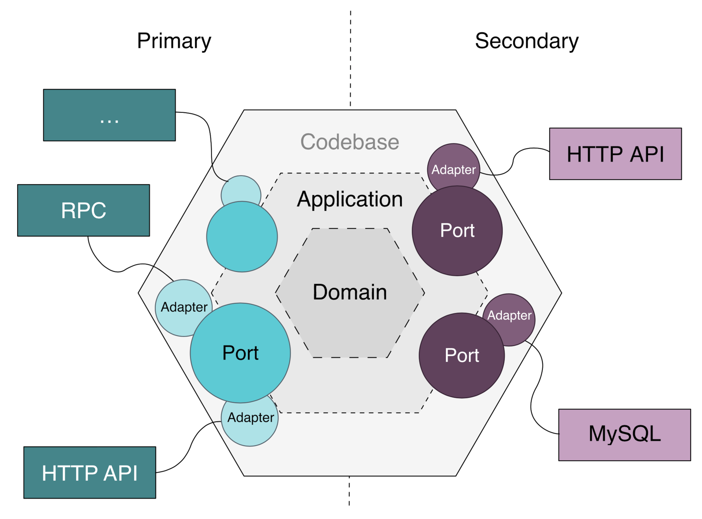
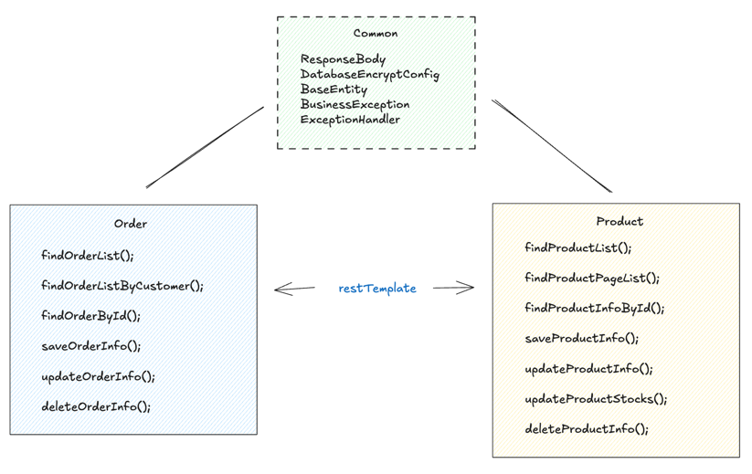
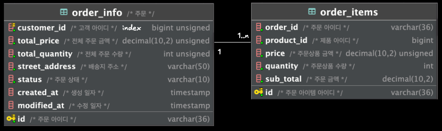
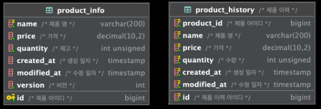

# Project Summary
본 프로젝트는 멀티 모듈(Multi-Module) 기반의 Spring Boot 프로젝트로, 다음과 같은 모듈들로 구성되어 있습니다.

- Common 모듈: 공통적으로 사용되는 응답 포맷, 예외 처리, 엔티티 등의 기능을 제공하는 모듈
- Order 모듈: 주문 관련 도메인을 관리하는 모듈 (주문 조회, 생성, 수정, 삭제 기능 포함)
- Product 모듈: 제품 정보를 관리하는 모듈 (제품 조회, 등록, 수정, 재고 관리 포함)
  
각 모듈은 DDD(Domain-Driven Design) 원칙을 지향하여 설계되었으며 Order 모듈과 Product 모듈은 독립적인 웹 모듈로 동작합니다.

### DDD(Domain Driven Design)

도메인 객체 중심의 설계를 위해 전술적 DDD를 따르며, Hexagonal Architecture를 적용하여 유연한 애플리케이션 구조를 구현하고자 했습니다.

#### Core Domain Layer (Business Logic)
- 도메인 엔티티

#### Application Layer (Use Cases / Ports)
- Input Port
  - Use case
- Output Port
  - RepositoryPort (DB 연결 인터페이스)
  - ExternalApiAdapter (외부 API 연결 인터페이스)

#### Infrastructure Layer (Adapters)
- Input Adapter 
  - Controller 
- Output Adapter 
  - JpaAdapter (DB 연결)
  - ExternalApiAdapter (외부 API 연결)

## Project Structure


## Entity Relationship Diagram
### order


### product


## 사용된 도구 요약
* Java 17 - 사용된 프로그래밍 언어
* Spring Boot 3 - 사용된 프레임워크
* Maven - 의존성 관리 도구
* Lombok - Java 라이브러리, 코드 단순화 도구
* MySQL - RDBMS
* JPA - Java Persistence API, 데이터 접근 및 관리를 위한 표준
* MapStruct - Java bean 매핑 도구

## 설계 의도
### API 설계
* HTTP Method:
    * 조회: 검색 조건이 많지 않고 민감 정보를 포함하지 않는다고 판단하여 `GET` 메소드를 사용했습니다.
    * 수정: 전체 리소스를 업데이트 하는 것이 아닌 일부만 수정하는 성질을 가졌기 때문에 `PATCH` 방식을 사용했습니다.
    * 삭제: 주문 정보를 삭제할 때 `DELETE` 메소드를 사용했습니다.
### Entity 관계
* 양방향 설계(주문)
  * 비즈니스 관점에서 Order(1) → OrderItem(N) 조회가 자주 필요하여 양방향 매핑을 적용했습니다.
* Lazy Loading 사용
  * 객체를 조회할 때 불필요한 객체 조회를 방지하기 위해 지연 로딩을 사용했습니다.
  * 다만, 연관 관계 객체에 접근할 때 N+1 문제가 발생할 수 있기 때문에 이러한 경우에는 fetch join을 사용했습니다.

## 기본 응답 포맷
```json
{
    "code": 200,
    "message": "OK",
    "data": { }
}
```
## 에러 응답 포맷
```json
{
    "code": "ERROR code" ,
    "message": ""
}
```

## 아쉬운 점
* 동적 조회의 경우 현재 코드로 filter를 하고 있는데, 자주 조회하는 컬럼을 인덱스로 설정하고 QueryDSL과 조합하여 사용하면 더 효율적일 것 같습니다.
* Command와 Query를 분리하여 구현한 만큼, 서비스 간 소통을 이벤트 기반으로 확장하는 방안도 고려할 수 있습니다.
